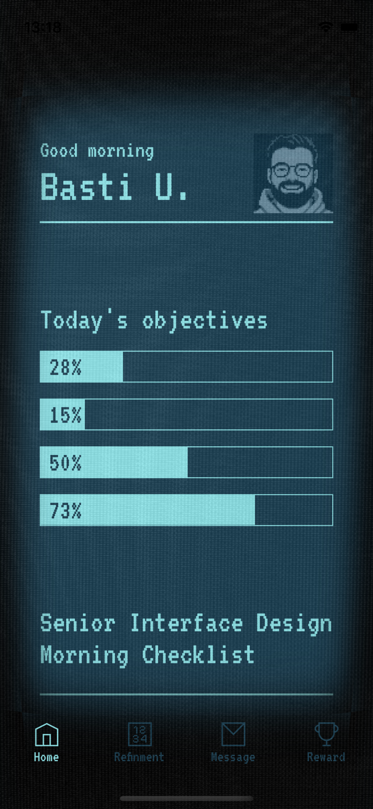
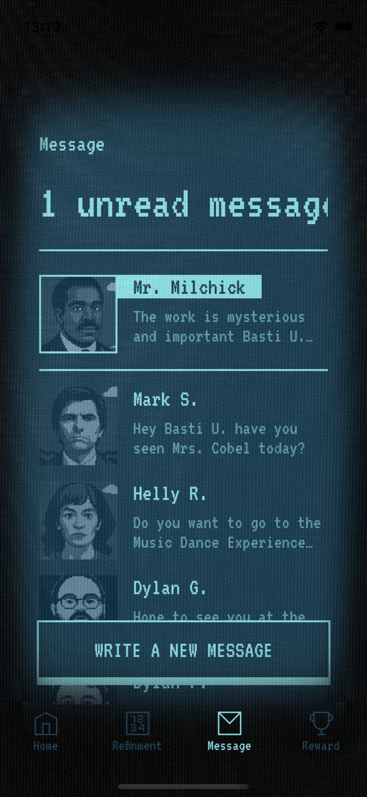
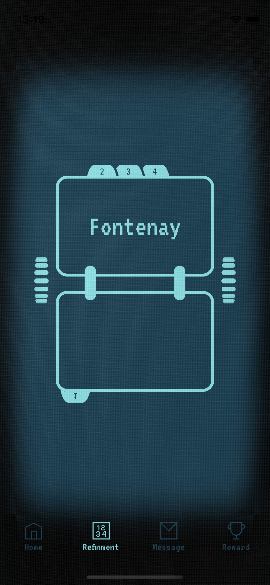
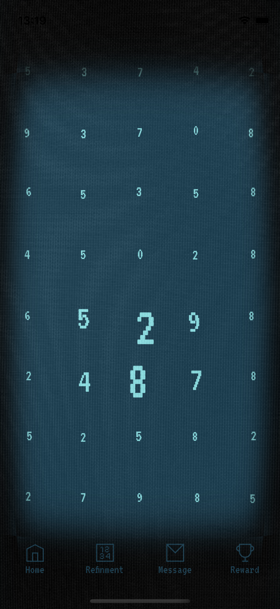

# 📱 LumonOS – UI Clone (Severance Inspired)

Une intégration mobile du système "LumonOS", imaginé par [BastiUI](https://www.youtube.com/@BastiUI) sur sa chaîne YouTube.  
Basé sur l’univers de la série _Severance_, ce projet est une reproduction de ce à quoi pourrait ressembler l'UI des téléphones portables si un jour les innies y avaient l'accès.

> 🔧 Projet personnel sans but, pour se remettre à niveau sur React Native

## Aperçu

🎨 Maquette originale : [Figma par BastiUI](https://www.youtube.com/redirect?event=video_description&redir_token=QUFFLUhqbjN6RmNTbHNYcDdJQlg1NzVtRkF2NUxqQzJBUXxBQ3Jtc0tsOUdqV1ZYRzlfQld6YjBrRGkxOTVTQlM0N1V6RWNfdmJSRTZfOEFYWmp0N1JvN3RpVERYVjhCLUd0U0NJTTR1ZlE2d1pUY2NoU3VkdURiNDJ3bDBjbksxN1hyaDNFSTlQbmdKTll5TTBhN3VxY3d6cw&q=https%3A%2F%2Fwww.figma.com%2Fcommunity%2Ffile%2F1505306892075653271&v=1k6ucFbyrsY)  
📺 Vidéo YouTube : [Intégration de l’UI LumonOS](https://youtu.be/1k6ucFbyrsY?si=hvYff_0mHXLBtM73)

<p align="center">
  
  
  
  
</p>

## Stack technique

- [React Native](https://reactnative.dev/)
- [Expo](https://expo.dev/)
- [Expo Router](https://expo.github.io/router/)
- [Reanimated](https://docs.swmansion.com/react-native-reanimated/docs/fundamentals/getting-started/)
- [React Native Skia](https://shopify.github.io/react-native-skia/docs/getting-started/installation)

L'écran de refinment (dernier screen) n'est pas le mien, mais celui de [William Candillon](https://www.youtube.com/c/wcandillon), réalisé sur sa chaîne youtube avec React Native Skia.
Tous les autres écrans sont de moi.

## Lancer le projet

1. Clone le repo

   ```bash
   git clone https://github.com/AlexisGadbin/LumonOS.git
   cd LumonOS
   ```

2. Installe les dépendances

   ```bash
   npm install
   ```

3. Démarre l’application
   ```bash
   npx expo start
   ```

## Bugs connus

- Le rolodex gère mal le Z-index lorsque les pages sont tournées, et donc le retour à la page précédente ne se fait pas dans le bon ordre.

## Crédit

Réalisé par [Alexis Gadbin](https://alaikssi.com)  
Projet non commercial. Juste une intégration UI pour progresser avec plaisir
